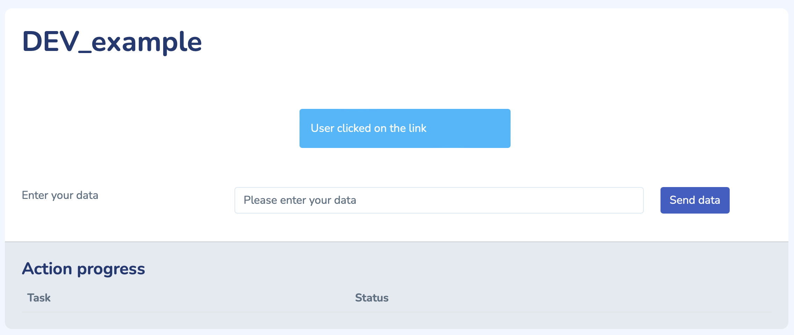

.. role:: python(code)
  :language: python
  :class: highlight

Site handler
************

Each tool, or site handler, represent a website. A site handler consists, a minima, of a set of pages, and a site conf.

Pages
#####

Basic page creation
-------------------
Let's look at a minimum webpage example:

.. code-block:: python

    bp = Blueprint('prog', __name__, url_prefix='/prog')

    @bp.route('/firmware', methods=['GET', 'POST'])
    def firmware():
        return render_template("base_content.j2")

    @bp.route('/software', methods=['GET', 'POST'])
    def software():
        return render_template("base_content.j2")

It is good practice to regroup pages that are relative to the same matter. For instances, we can regroup all the pages that are relative to the programming of the station together.

This grouping match the notion of **blueprint** in flask. Blueprints will be a collection of pages that share the same base address. As a results, the two pages in the example will have "prog" as base address.

When a user click a link, he will be redirected to a function. The directive :python:`@bp.route('/software', methods=['GET', 'POST'])` indicate that the function will be at address **/prog/software** and that valid call methods are "GET" and "POST"

The function called is than free to do any kind of work, and will then return some html content. To facilitate the content creation, the framework uses the language "jinja". This allows to generate html pages with python variables easily.

Generating page content
-----------------------
To generate page content, the framework provides a set of usefull helper functions.

A basic page could be the following:

.. code-block:: python

    from OuFNis_DFDIG.modules import DEV_example

    bp = Blueprint('help', __name__, url_prefix='/help')

    @bp.route('/dev_example', methods=['GET', 'POST'])
    def dev_example():

        ##Init the view
        dev = utilities.util_view_init([DEV_example.DEV_example])

        ##Handle user data
        if request.method == "POST":
            data = utilities.util_post_to_json(request.form.to_dict())
            text = "User posted data"
        else:
            text = "User clicked on the link"
        
        ##Add some content to the page
        utilities.util_view_add_info_text(dev, DEV_example.DEV_example, text)

        inputs = []
        inputs.append({"label": "Enter your data", "id": "user_text", "value": "Please enter your data", "type": "text"})

        utilities.util_view_add_multi_input(dev, DEV_example.DEV_example, "user_in", inputs, "Send data")

        ##Render
        return render_template('base_content.j2', content=dev, target="help.dev_example")

The code does the following:

* Generate a blueprint "help"
* Link the function :python:`dev_example()` to the blueprint
* Initialize a view object, based on the module :python:`DEV_example()`. Viewing object are always linked to modules, and use it's name as title in the webpage. Please note that the module argument is a list: it is possible to add several modules; each of them will be represented by a different section in the webpage.
* Detect if the users came here with a link ("GET" method) or throught a formulaire ("POST" method), and generate a text accordingly
* Add this text to the view object
* Generate a text input for the user to display, and add it for rendering

The resulting page will be:

Head to the :func:`utilities` functions documentation for more information on how to populate the web page.

Site configuration
##################

Every site handler should have its own site-conf, which inherits from the basic site-conf. For more information, please see the documentation: :meth:`site_conf.Site_conf`

Sidebar
-------

Creating page is good, being able to access it is better. This is were the site conf module comes in play. Every site handler must have a **site_conf.py** at the appropriate location (see `File Structure`_)

Registering the sidebar is done in the :python:`__init__()` function, as illustrated bellow:

.. code-block:: python

    class site_conf(site_conf.site_conf):
        def __init__(self):
            # Setup sidebar
            self.add_sidebar_title("Tools")

            self.add_sidebar_section("Low level tools", "wrench", "lltools")
            self.add_sidebar_submenu("Debug packages", "lltools.debug_pack")
            self.add_sidebar_submenu("LRU Tools", "lltools.lru")

The second argument of the :python:`add_sidebar_submenu()` is the link of the page, that is **blueprint.page**.

Other
-----
The site conf also allows to:

* Register topbar buttons
* Indicate the site handler information (name, version, etc..)
* Add specific optional javascript files
* Activate login and authorizations
* etc.

Finaly, some function of the basic site conf can be overwritten to extend some possiblities, please see the documentation :meth:`site_conf.Site_conf`

Module
######

Modules are either threaded actions or simple actions that are meant to do a set of jobs. Threaded actions are registered in the Thread manager, and can be used for long term job. The scheduler offers a set of communication function to commicate the progress of the function to the user.

The simplest module is:

.. code-block:: python

    class DEV_example(threaded_action.Threaded_action):
        m_name = "DEV_example"

        def action(self):       
            return

In its bare form, this module does nothing, and is just registering it's name, for use with the viewing functions.

The job to be done takes place in the :python:`action()` function. When the page engine calls for the :python:`start()` function of the parent calss :python:`Threaded_action()`, the parent initialize the thread, call the action, and when returning, destroy the thread.
In this simple example, the thread will be destroyed as soon as it is created, however, on longer action like programing a firmware, the thread can live a longer time. It is even possible to prevent destruction of the thread so that it continues to work ad vitam eternam.

File structure
##############
The site handler basic structures is:
::

    | website1
    | ├── modules (List of the modules)
    | ├── pages (Pages generation function)
    | ├── workflows (Workflow ressources)
    | ├── config.json
    | ├── site_conf.py
